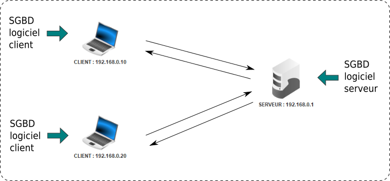

.. TNSI

.. toctree::
   :maxdepth: 1

SGBD et langage SQL
===================

Qu'est-ce qu'un SGBD ?
----------------------

**SGBD** est l'acronyme de **S**\ ystème de **G**\ estion de **B**\ ase de **D**\ onnées.

Un SGBD est un logiciel qui permet de créer et gérer des bases de
données accessibles à un ou plusieurs utilisateurs.

Le langage utilisé dans les SGBD est le **SQL**, acronyme de
**S**\ tructured **Q**\ uery **L**\ anguage.

Les fonctionnalités d'un SGBD sont:

-  créer des bases de données, ensemble de relations (tables);
-  créer des relations (tables) à partir d'un schéma relationnel;
-  ajouter, modifier, supprimer des données dans les relations
   (tables);
-  effectuer des requêtes pour interroger les relations, obtenir des
   données, triées ou non, respectant une ou plusieurs conditions;
-  spécifier les contraintes d'intégrités : clefs primaires, clefs
   étrangères, domaine de valeurs;
-  sécuriser et pérenniser les données ;
-  gérer les droits, permissions, des utilisateurs de la base de
   données.

.. rubric:: Modèle client - serveur
   :name: modèle-client---serveur

   
Un SGBD est un logiciel installé sur un serveur. Dans ce mode de
fonctionnement, l'accès aux données à plusieurs utilisateurs est
possible.

Cela implique que le SGBD permette :

-  de créer, supprimer des utilisateurs, gérer l'authentification
   (login, mot de passe) pour la connexion à une base de données;
-  de gérer les permissions en lecture et écriture sur les relations
   de la base de données.
-  de gérer les accès concurrents, c'est à dire autoriser la lecture
   et l'écriture des données à plusieurs utilisateurs en même temps.

Il existe de nombreux SGBD qu'on peut classer en deux catégories :
libre ou propriétaire.

-  Parmi les logiciels libres : MySQL, PostgreSQL, MariaDB;
-  Parmi les logiciels propriétaires : ORACLE et Microsoft SQL Server

.. rubric:: Modèle embarqué
   :name: modèle-embarqué

**SQLITE** est un SGBD qui a la particularité de s'installer sur
toute plateforme en mode dit embarqué (non serveur). Cela permet de
gérer des bases de données sur une machine personnelle, très utile
pour le développement.

Le langage SQL
--------------

Le langage majoritairement utilisé dans les SGBD est le SQL :
Structured Query Language.

Ce langage permet de réaliser des **requêtes** sur les **relations**
d'une base de données pour en extraire les données qu'elles contient.

Le langage SQL utilise des **clauses** qui permettent:

-  la sélection de données avec la clause ``SELECT``. Elle peut être accompagnée des clauses ``DISTINCT``, ``WHERE`` et
   ``ORDER BY`` pour affiner la recherche;
-  L'ajout de données dans une relation avec la clause ``INSERT INTO``;
-  La mise à jour ou la modification d'une donnée avec la clause ``UPDATE``;
-  La suppression d'un enregistrement d'une relation avec la clause ``DELETE``.

.. note::

   -  Une requête SQL se termine par un point-virgule. Dans un client en console, la saisie du point virgule déclenche la requête.
   -  Une requête SQL peut s'écrire sur plusieurs lignes.
   -  Les clause présentées ci-dessus sont des clauses importantes mais il en existe beaucoup d'autres qui permettent de créer des
      relation, supprimer des relations, etc.

Clause SELECT ... FROM
**********************

La clause ``SELECT ... FROM`` réalise la sélection de données dans une relation:

.. code:: sql

   SELECT attribut1, attribut2,... FROM relation;

Cette clause peut s'accompagner de la clause ``DISTINCT`` qui évite la redondance des données lorsque la requête
renvoie plusieurs fois les mêmes valeurs.

.. code:: sql

   SELECT DISTINCT attribut1, attribut2,... FROM relation;

La sélection de tous les attributs d'une table peut se faire avec l'étoile ``\*``:

.. code:: sql

   SELECT * FROM relation;

La sélection peut être triée avec la clause ``ORDER BY``, soit par ordre croissant avec la clause ``ASC`` ou par ordre
décroissant avec la clause ``DESC``:

.. code:: sql

   SELECT * FROM relation ORDER BY attribut ASC;

Clause SELECT ... FROM ... WHERE
*********************************

La clause ``WHERE`` impose une **condition** sur l'**attribut** à respecter dans la requête:

.. code:: sql

   SELECT attribut(s) FROM relation WHERE condition(s);

Il est possible d'ajouter plusieurs conditions et utiliser les opérateurs logiques ``AND``, ``OR`` et ``NOT``.

Les principaux opérateurs utilisés dans les conditions sont rassemblés dans le tableau:

+--------------------------+--------------------------+----------------+
| Opérateur                | Description              | Syntaxe        |
+==========================+==========================+================+
| =                        | égal                     | attribut =     |
|                          |                          | valeur         |
+--------------------------+--------------------------+----------------+
| :math:`<>` ou !=         | différent                | attribut <>    |
|                          |                          | valeur         |
+--------------------------+--------------------------+----------------+
| :math:`>` et :math:`<`   | supérieur à et inférieur | attribut >     |
|                          | à                        | valeur         |
+--------------------------+--------------------------+----------------+
| :math:`>=` et :math:`<=` | supérieur ou égal à et   | attribut >=    |
|                          | inférieur ou égal à      | valeur         |
+--------------------------+--------------------------+----------------+
| IN                       | Liste de plusieurs       | attribut IN    |
|                          | valeurs possibles        | (valeur1,va    |
|                          |                          | leur2,valeur3) |
+--------------------------+--------------------------+----------------+
| BETWEEN                  | Valeur comprise dans un  | attribut       |
|                          | intervalle donné         | BETWEEN        |
|                          |                          | valeur1 AND    |
|                          |                          | valeur2        |
+--------------------------+--------------------------+----------------+
| LIKE                     | Recherche en spécifiant  | attribut LIKE  |
|                          | le début, milieu ou fin  | valeur         |
|                          | d'un mot                 |                |
+--------------------------+--------------------------+----------------+
| IS NULL                  | attribut de valeur nulle | attribut IS    |
|                          | (vide)                   | NULL           |
+--------------------------+--------------------------+----------------+
| IS NOT NULL              | attribut de valeur non   | attribut IS    |
|                          | nulle (non vide)         | NOT NULL       |
+--------------------------+--------------------------+----------------+

.. note::

   #. Plusieurs conditions sont possibles avec les opérateurs AND et OR;
   #. La négation d'une condition se fait avec NOT.
   #. Le caractère % s'utilise avec l'opérateur LIKE et signifie toute chaine de caractères.

      Par exemple, pour tous les mots qui commençent par **ch**, on note ``LIKE ch%``.

.. admonition:: Exemples avec la clause WHERE

   On considère une relation **auteur** avec les 2 attributs **nom** et **année** (de naissance).

   #. On recherche les noms des auteurs nés en 1980.

   .. code:: sql

      SELECT nom FROM auteur WHERE année = 1980;

   #. On recherche les noms des auteurs nés entre 1980 et 2000

   .. code:: sql

      SELECT nom FROM auteur WHERE année BETWEEN 1980 AND 2000;

   #. On recherche les noms des auteurs qui commencent par la lettre "S"

   .. code:: sql

      SELECT nom FROM auteur WHERE nom LIKE 'S%';

   #. On recherche les noms des auteurs qui finissent par la lettre "p"

   .. code:: sql

      SELECT nom FROM auteur WHERE nom LIKE '%p';

   #. On recherche les noms des auteurs contenus dans la liste ("Rowling","Vargas")

   .. code:: sql

      SELECT nom FROM auteur WHERE nom IN ("Rowling","Vargas");

   #. On recherche les noms des auteurs qui sont vides

   .. code:: sql

      SELECT nom FROM auteur WHERE nom IS NULL;

Les fonctions d'agrégation
**************************

Les fonctions d'agrégation permettent d'effectuer quelques statistiques sur les relations d'une base de données. Les principales
fonctions sont les suivantes :

-  ``AVG()`` pour calculer la moyenne des valeurs d'un attribut;
-  ``COUNT()`` pour compter le nombre d'enregistrements sur une table ou un un attribut précisé;
-  ``MAX()`` pour récupérer la valeur maximum d'un attribut sur un ensemble de ligne. Cela s'applique à la fois pour des données
   numériques ou alphanumériques;
-  ``MIN()`` pour récupérer la valeur minimum de la même manière que ``MAX()``;
-  ``SUM()`` pour calculer la somme de valeurs sur un ensemble d'enregistrements.

Ces fonctions se placent juste après la clause ``SELECT``. La requête peut être soumise à condition(s) mais non obligatoire.

.. code:: sql

   SELECT Fonction agrégation FROM relation WHERE condition(s);

Insérer des données
*******************

La clause ``INSERT INTO ... VALUES ...`` ajoute un enregistrement (tuple) à une relation. Il faut indiquer le nom de la
relation en précisant les attributs, entre parenthèses, et indiquer les valeurs à ajouter entre parenthèses.

.. code:: sql

   INSERT INTO relation (attribut1, attribut2, ...) VALUES (valeur1, valeur2, ...);

Dans la même requête, il est possible d'ajouter plusieurs nouveaux enregistrements séparés par des virgules.

.. admonition:: Exemples avec la clause INSERT INTO

   On considère la relation **auteur** contenant les attributs **nom**, **année** et la clé primaire **id_auteur**.

   #. Insertion de l'auteur "Rowling" née en 1965 :

      .. code:: sql

         INSERT INTO auteur (id_auteur, nom, année) VALUES (24,"Rowling", 1965);

   #. Insertion des auteurs J. R. R. "Tolkien" né en 1892 et George R. R. "Martin" né en 1948:

      .. code:: sql

         INSERT INTO auteur (id_auteur, nom, année) 
         VALUES (25,"Tolkien", 1892), (26,"Martin", 1948);

.. note::

   #. Il n'est pas obligatoire de préciser les attributs mais il faut bien veiller à mettre les valeurs dans l'ordre
      des attributs de la relation.
   #. On peut mettre les attributs dans un ordre différent en prenant soin de mettre les valeurs dans le même ordre.

Mettre à jour un enregistrement d'une relation
**********************************************

La clause ``UPDATE`` permet de mettre à jour une relation en modifiant des valeurs. La requête doit préciser l'attribut
à modifier avec sa nouvelle valeur et le même attribut avec son ancienne valeur sous la forme d'une condition.

La syntaxe est la suivante:

.. code:: sql

   UPDATE relation SET attribut = nouvelle valeur WHERE attribut = ancienne valeur;

La condition n'est pas nécessairement une égalité stricte. Si la condition renvoie plusieurs enregistrements, ils
seront tous mis à jour avec la nouvelle valeur.

.. admonition:: Exemple de requête de mise à jour
      
   On conserve la relation auteur pour laquelle on souhaite modifiée une année de naissance.

   .. code:: sql

      UPDATE auteur SET année = 2001 WHERE nom="Rowling";

Supprimer un enregistrement d'une relation
******************************************

La clause ``DELETE FROM`` supprime un enregistrement. Cette clause s'accompagne d'une condition pour déterminer les
enregistrements à supprimer. La requête SQL est exécutée sans demande de confirmation.

La syntaxe est la suivante:

.. code:: sql

   DELETE FROM relation WHERE condition(s);

.. admonition:: Exemple de suppression

   On conserve la relation auteur pour laquelle on souhaite modifiée une
   année de naissance.

   .. code:: sql

      DELETE FROM auteur WHERE nom="Rowling";

.. attention::
   
   Si la clause ``WHERE`` n'est pas donnée dans un ``DELETE``, alors tous les enregistrements de la relation sont supprimés.

Les jointures en SQL
--------------------

Les données à recueillir peuvent se situées dans des relations différentes. Pour les obtenir, il est donc nécessaire de
joindre les relations.

La clause ``JOIN`` permet de rassembler deux ou plusieurs relations à l'aide des **clés étrangères**.

La syntaxe est la suivante pour effectuer une jointure:

.. code:: sql

   SELECT attribut(s) FROM relation1
   JOIN relation2 ON relation1.clef_etrangere = relation2.clef_primaire;

Il est possible de joindre plusieurs relations:

.. code:: sql

   SELECT attribut(s) FROM relation1
   JOIN relation2 ON relation1.clef_etrangere = relation2.clef_primaire
   JOIN relation3 ON relation2.clef_etrangere = relation3.clef_primaire;

.. note::

   #. Les attributs appartiennent aux relations jointes et pas seulement la première relation indiquée.
   #. Il est important de repérer les clés étrangères pour les relier aux clés primaires correspondantes.
   #. Si les clés étrangères et primaires n'ont pas le même nom, il n'est pas utile de les préfixer par le nom des relations.
   #. On peut également ajouter la clause ``WHERE`` aux clauses ``JOIN``.

.. admonition:: Exemple de jointure

   On considère la base de données selon le modèle relationnel suivant:

   .. image:: ../img/schema_relationnel_ex1.png
      :alt: schema_relationnel_ex1.png
      :align: center
      :width: 460
      :class: b-8

   #. On souhaite recueillir les titres des livres et les dates d'emprunts. Ces données sont dans deux relations différentes.
      Heureusement la table **Emprunts** dispose d'une clé étrangère la reliant à la relation **Livres**.

      On réalise donc une jointure entre les tables **Livres** et **Emprunts**.

      .. code:: sql

         SELECT titre, dateEmprunt FROM Livres
         JOIN Emprunts ON Livres.isbn = Emprunt.isbn;

   #. On peut soumettre cette recherche aux livres empruntés avant une date donnée.

      .. code:: sql

         SELECT titre, dateEmprunt FROM Livres
         JOIN Emprunts ON Livres.isbn = Emprunt.isbn
         WHERE dateEmprunt < 10012022;

   #. On veut récupérer les noms des élèves qui n'ont pas encore rendu les livres empruntés. Il faut joindre la
      troisième relation **Eleves** avec la clef étrangère **idEleve**.

      .. code:: sql

         SELECT titre, dateEmprunt FROM Livres
         JOIN Emprunts ON Livres.isbn = Emprunt.isbn
         JOIN Eleves ON Eleves.idEleve = Livres.idEleve
         WHERE dateEmprunt < 10012022;
